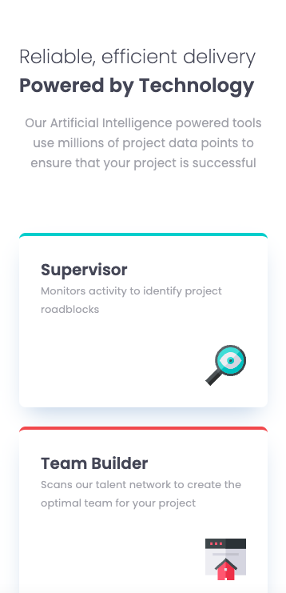
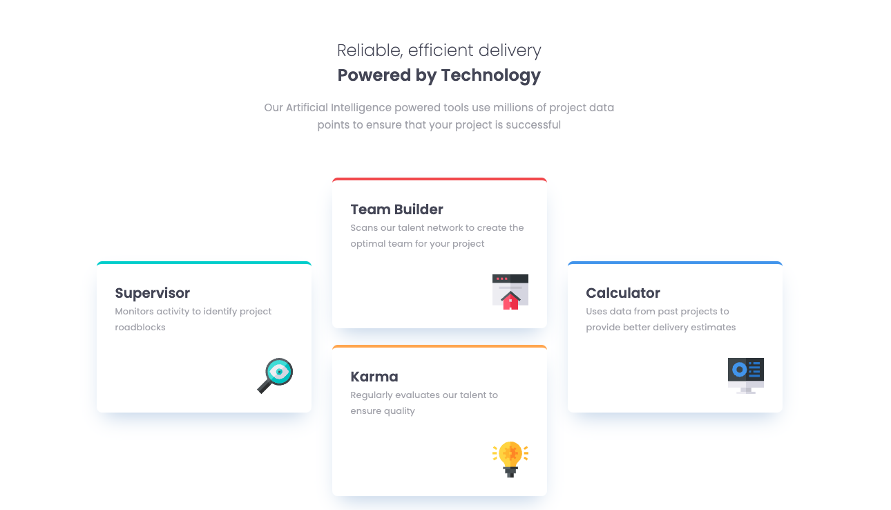

# Frontend Mentor - Four card feature section solution<!-- omit in toc -->

This is a solution to the [Four card feature section challenge on Frontend Mentor](https://www.frontendmentor.io/challenges/four-card-feature-section-weK1eFYK). Frontend Mentor challenges help you improve your coding skills by building realistic projects.

## Mobile<!-- omit in toc -->

## Desktop<!-- omit in toc -->

## Table of contents<!-- omit in toc -->

- [Overview](#overview)
  - [The challenge](#the-challenge)
  - [Links](#links)
- [My process](#my-process)
  - [Built with](#built-with)
- [Author](#author)

## Overview

### The challenge

Users should be able to:

- View the optimal layout for the site depending on their device's screen size

### Links

- [GitHub repo](https://github.com/awesomeCoding999/frontend-mentor-four-card-feature)
- [Live site](https://awesomecoding999.github.io/frontend-mentor-four-card-feature/)

## My process

### Built with

- Semantic HTML5 markup
- CSS custom properties
- Flexbox
- Mobile-first workflow

## Author

- Frontend Mentor - [CodingChick](https://www.frontendmentor.io/profile/awesomeCoding999)
